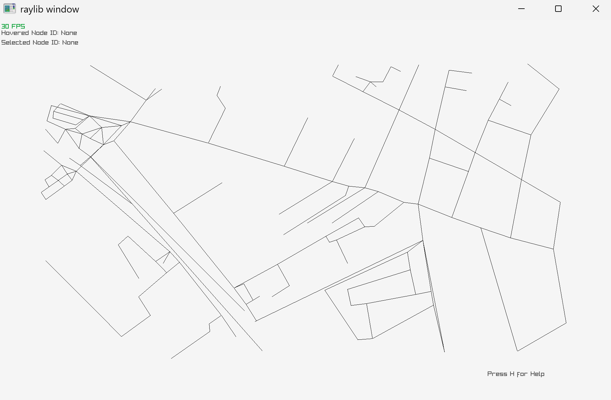
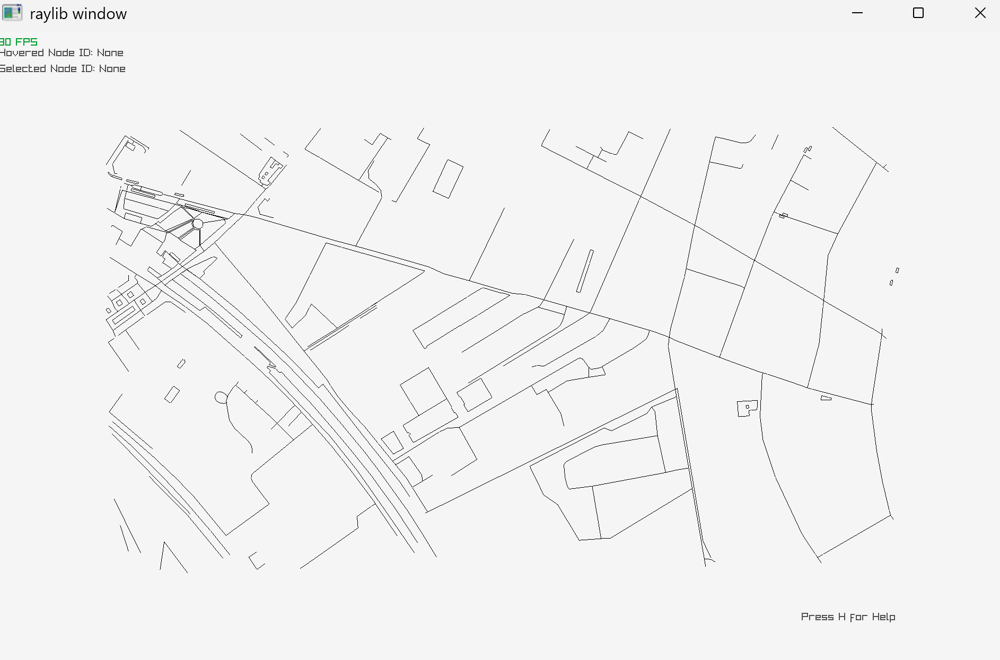

# TD7

## Exercice 2 - Lecture de code et compréhension

### 1. Identifiez où sont définies les structures principales du graphe (WeightedGraph / PositionedGraph) et expliquez brièvement leur rôle et comment elles sont utilisées.

Les structures principales du graphe WeightedGraph et PositionedGraph sont définis dans les dossiers dataStructure et osm.

WeightedGraph stocke le poid de chaque trait et point.

PositionedGraph sert à stocker leurs positions.

### 2. Expliquez en quelques lignes le rôle des modules:

**- extract** : lis le fichier osm et en fait une représentation graphique. 
    A besoin de deux arguments : 
        - *input* : chemin d'accès au fichier osm
        - *output* : chemin où doit être créer la représentation graphique + ".graph".

**- simplify** : simplifie le graph créer par extract en supprimant les traits et les points inutiles 
    A besoin d'un seul argument : 
        - *input* : chemin d'accès au fichier de la représentation graphique

**- visualize** : permet de visualiser le graph par le fichier de représentation graphique 
    A besoin d'un seul argument : 
        - *input* : chemin d'accès au fichier de la représentation graphique
  
visuel simplifié : 
visuel non simplifié : 

### 3. Expliquez ce que vous comprenez des différentes étapes de simplification implémentées (fichier src/simplification/simplify.cpp) et les raisons pour lesquelles elles sont utilisées (leur impact sur la structure du graphe, les avantages/inconvénients, etc.).

Voici ce que je comprend des différentes étapes de simplification implémentées : 

    - **keep_only_largest_connected_component(graph)** : compare les différents composants et garde le plus grand, il supprime les points qui ne sont pas dans le composant le plus grand.
  
    *Pourquoi* : Ca permet de simplifier la représentation de chemin/structure sur la carte mais ca les simplifie parfois trop, au point que des tracés important pour la compréhension sont supprimés.
  
    - **remove_small_ending_edge(graph, 10.0)** : stock dans un tableau tout les points/noeuds à supprimer en fonction de la taille du voisin/du degré, s'il est inférieur à 1 alors on met le point dans le tableau de ce qui doivent être supprimé. A la toute fin on supprime tout les points noté dans le tableau des points à supprimer.

    *Pourquoi* : Permet de supprimer les bords inutiles qui vont trop dans le détail du graphe.

    - **remove_degree_two_nodes_by_angle_threshold(graph, 30)** : 
    S'il existe un point entre deux points dont l'angle est "inutile", alors on supprime ce point car la liaison des deux points qui encerclent l'angle n'en sera pas impacté.

    *Pourquoi* : Permet de supprimer les points et informations inutiles et de garder l'essentiels.

    - **group_nodes_by_connection_depth_and_proximity(graph, 10.0, 6)** : On créer différent tableau qu'on appelle cluster qui permettent de trier les différents noeuds en fonction de leur proximité et de leur profondeur.

    *Pourquoi* : permet de trier et classer les noeuds/points en différente catégorie.

    - **remove_degree_two_nodes_by_angle_threshold(graph, 30)** : 
    S'il existe un point entre deux points dont l'angle est "inutile", alors on supprime ce point car la liaison des deux points qui encerclent l'angle n'en sera pas impacté.

    *Pourquoi* : Permet de supprimer les points et informations inutiles et de garder l'essentiels.

  
Et voici les raisons pour lesquelles elles sont utilisées (leur impact sur la structure du graphe, les avantages/inconvénients, etc.) : 